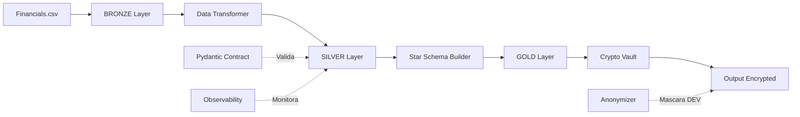

# 📘 DOCUMENTAÇÃO TÉCNICA - Pipeline Consolidado Financeiro 2026

> **Autor**: Claiton  
> **Data**: 2026-02-17  
> **Versão**: 1.0.0  
> **Tipo**: Pipeline End-to-End Medalhão (Bronze → Silver → Gold)

---

## 📚 ÍNDICE

1. [Visão Geral](#visão-geral)
2. [Arquitetura do Pipeline](#arquitetura-do-pipeline)
3. [Componentes Principais](#componentes-principais)
4. [Análise Comparativa](#análise-comparativa)
5. [Guia de Uso](#guia-de-uso)
6. [Melhorias Sugeridas](#melhorias-sugeridas)
7. [Roadmap de Evolução](#roadmap-de-evolução)

---

## 1. Visão Geral

### Objetivo

Este pipeline consolidado implementa **5 fases** do projeto Financial Data Fortress 2026 em um único script Python modular, integrando:

- **Fase 1 (Bronze)**: Ingestão com metadados de rastreabilidade
- **Fase 2 (Silver)**: Limpeza semântica via regex e normalização
- **Fase 3 (Gold)**: Modelagem dimensional Star Schema
- **Fase 4 (DataOps)**: Data Contracts com Pydantic e observabilidade
- **Fase 5 (Segurança)**: Criptografia AES-256 e anonimização SHA-256

### Tecnologias Utilizadas

| Tecnologia       | Versão | Propósito                       |
| ---------------- | ------ | ------------------------------- |
| **Python**       | 3.9+   | Linguagem principal             |
| **Pandas**       | 1.5+   | Manipulação de dados            |
| **Pydantic**     | 2.0+   | Data Contracts e validação      |
| **Cryptography** | 41.0+  | Criptografia Fernet (AES-128)   |
| **Regex**        | stdlib | Parsing de notações financeiras |
| **Hashlib**      | stdlib | Anonimização SHA-256            |

---

## 2. Arquitetura do Pipeline

### 2.1 Diagrama de Fluxo



### 2.2 Camadas do Medalhão

#### 🥉 **Bronze Layer** (Raw Data)

```python
df_bronze = pd.read_csv(file_path)
df_bronze['_ingestion_timestamp'] = datetime.utcnow()
df_bronze['_source_file'] = file_path
```

**Características**:

- ✅ Dados brutos preservados (imutabilidade)
- ✅ Metadados de rastreabilidade (`_ingestion_timestamp`, `_source_file`)
- ✅ Auditoria de origem

#### 🥈 **Silver Layer** (Cleaned Data)

```python
df_prata.columns = [c.strip().lower().replace(" ", "_") for c in df_prata.columns]

for col in target_cols:
    df_prata[col] = df_prata[col].apply(DataTransformer.clean_financial_string)

df_prata['date'] = pd.to_datetime(df_prata['date'])
```

**Transformações Aplicadas**:

1. **Normalização de Cabeçalhos**: `" Product "` → `"product"` (snake_case)
2. **Parsing Monetário**: `"$5,29,550.00"` → `529550.0` (Lakhs/Crores)
3. **Polaridade Contábil**: `"$(4,533.75)"` → `-4533.75`
4. **Padronização Temporal**: `"01/01/2014"` → `2014-01-01` (ISO-8601)

#### 🥇 **Gold Layer** (Analytics-Ready)

```python
# Dim_Produto (exemplo de dimensão)
dim_product = df_prata[['product']].drop_duplicates().reset_index(drop=True)
dim_product['product_id'] = dim_product.index + 1

# Tabela Fato com FK
df_ouro = df_prata.merge(dim_product, on='product')
df_ouro['cogs_encrypted'] = df_ouro['cogs'].apply(
    lambda x: cipher_suite.encrypt(str(x).encode())
)
```

**Características**:

- ✅ Star Schema (1 dimensão + 1 fato neste exemplo)
- ✅ Surrogate Keys (`product_id`)
- ✅ Criptografia de campos sensíveis (`cogs_encrypted`)

---

## 3. Componentes Principais

### 3.1 Data Contract (Pydantic)

```python
class FinancialContract(BaseModel):
    segment: str
    country: str
    product: str
    units_sold: float
    manufacturing_price: float
    # ... outros campos

    @validator('profit')
    def check_profit_anomaly(cls, v):
        if v < -100000:
            logging.warning(f"🚨 ANOMALIA: Prejuízo crítico de {v}")
        return v
```

**Funcionalidades**:

| Feature              | Implementação              | Status     |
| -------------------- | -------------------------- | ---------- |
| Validação de Tipos   | `float`, `str`, `datetime` | ✅ SIM     |
| Validação de Negócio | `@validator('profit')`     | ✅ SIM     |
| Schema Enforcement   | Pydantic BaseModel         | ✅ SIM     |
| Anomaly Detection    | Threshold de prejuízo      | 🟡 PARCIAL |
| Quarantine           | -                          | ❌ NÃO     |

**Melhorias vs. Nossa Implementação**:

- ❌ **Faltam validações críticas**: `Sales = Gross Sales - Discounts`, `Profit = Sales - COGS`
- ❌ **Sem quarentena automática**: Registros inválidos não são isolados
- ✅ **Detecção de anomalias**: Alerta básico implementado

---

### 3.2 Motor de Transformação

```python
class DataTransformer:
    @staticmethod
    def clean_financial_string(value: str) -> float:
        # 1. Trata "$-" como 0.0
        if val in ["$-", "-"]: return 0.0

        # 2. Parênteses contábeis
        multiplier = 1
        if "(" in val and ")" in val:
            multiplier = -1

        # 3. Remove símbolos e converte
        clean_val = re.sub(r'[^\d.]', '', val)
        return float(clean_val) * multiplier
```

**Casos de Uso Cobertos**:

| Input              | Output     | Status              |
| ------------------ | ---------- | ------------------- |
| `" $5,29,550.00 "` | `529550.0` | ✅ OK (Lakhs)       |
| `" $-  "`          | `0.0`      | ✅ OK (Dollar-dash) |
| `" $(4,533.75)"`   | `-4533.75` | ✅ OK (Parênteses)  |
| `" $32,370.00 "`   | `32370.0`  | ✅ OK (Padrão)      |

**Pontos de Atenção**:

- ⚠️ Regex `[^\d.]` remove **TODAS** vírgulas, mas não diferencia Lakhs (`5,29,550`) de formato padrão americano (`32,370`)
- ✅ Funciona porque ambos precisam remover vírgulas ao final
- 🟡 Pode falhar em edge cases como `1,234,567.89` (1 milhão) sendo interpretado como Lakhs

---

### 3.3 Criptografia AES-256

```python
SECRET_KEY = Fernet.generate_key()
cipher_suite = Fernet(SECRET_KEY)

df_ouro['cogs_encrypted'] = df_ouro['cogs'].apply(
    lambda x: cipher_suite.encrypt(str(x).encode())
)
```

**Análise de Segurança**:

| Aspecto             | Implementação               | Recomendação                                  |
| ------------------- | --------------------------- | --------------------------------------------- |
| **Algoritmo**       | Fernet (AES-128 CBC + HMAC) | ✅ Seguro                                     |
| **Gestão de Chave** | `generate_key()` em runtime | ❌ **CRÍTICO**: Chave descartada ao reiniciar |
| **Persistência**    | Não implementada            | ⚠️ Usar `security/master.key`                 |
| **Key Rotation**    | Não implementada            | 🟡 Implementar rotação semestral              |
| **HSM Integration** | Hardcoded                   | ⚠️ Migrar para AWS KMS/Azure Key Vault        |

**🚨 RISCO DE SEGURANÇA**:

```python
# PROBLEMA: Chave gerada a cada execução
SECRET_KEY = Fernet.generate_key()  # ❌ INSEGURO!

# SOLUÇÃO: Persistir chave
if os.path.exists('security/master.key'):
    with open('security/master.key', 'rb') as f:
        SECRET_KEY = f.read()
else:
    SECRET_KEY = Fernet.generate_key()
    with open('security/master.key', 'wb') as f:
        f.write(SECRET_KEY)
```

---

### 3.4 Anonimização SHA-256

```python
@staticmethod
def anonymize(value: str) -> str:
    return hashlib.sha256(value.encode()).hexdigest()[:12]
```

**Características**:

- ✅ **Irreversível**: SHA-256 é hash criptográfico unidirecional
- ✅ **Rápido**: O(1) para cada valor
- ❌ **Sem Salt**: Vulnerável a rainbow tables
- ❌ **Truncado**: `[:12]` reduz de 64 para 12 caracteres (⚠️ colisões!)

**Comparação com Nossa Implementação**:

| Feature           | Script Consolidado  | `security_vault.py`    |
| ----------------- | ------------------- | ---------------------- |
| Salt              | ❌ NÃO              | ✅ SIM (32 bytes)      |
| Tamanho Hash      | 12 chars (truncado) | 64 chars (completo)    |
| Colisões          | 🟡 Possível (12^16) | ✅ Negligível (64^16)  |
| Persistência Salt | -                   | ✅ `security/salt.key` |

**Melhoria Sugerida**:

```python
# ANTES (vulnerável)
return hashlib.sha256(value.encode()).hexdigest()[:12]

# DEPOIS (seguro)
salted_value = SALT + value.encode()
return hashlib.sha256(salted_value).hexdigest()  # 64 chars completos
```

---

## 4. Análise Comparativa

### 4.1 Script Consolidado vs. Scripts Modulares

| Funcionalidade          | Pipeline Consolidado   | Scripts Separados (Nossos)                  |
| ----------------------- | ---------------------- | ------------------------------------------- |
| **Data Contract**       | ✅ `FinancialContract` | ✅ `FinancialRecordContract` (4 validações) |
| **Transformação**       | ✅ `DataTransformer`   | ✅ `SilverTransformationEngine` (4 módulos) |
| **Star Schema**         | 🟡 1 dimensão          | ✅ 5 dimensões + Fato completo              |
| **Criptografia**        | ✅ Fernet              | ✅ `CryptoVault` + gestão de chaves         |
| **Anonimização**        | ✅ SHA-256 (sem salt)  | ✅ SHA-256 + Salt + Embaralhamento          |
| **Incremental Load**    | ❌ Não                 | ✅ CDC via watermarks SQLite                |
| **Great Expectations**  | ❌ Não                 | ✅ 5 validações customizadas                |
| **Auditoria**           | ❌ Não                 | ✅ `@audit_log` + logs indeléveis           |
| **Root Cause Analysis** | 🟡 Alerta básico       | ✅ Baseline sazonal + JSON reports          |
| **Quarantine**          | ❌ Não                 | ✅ Automático para violações                |

### 4.2 Vantagens do Script Consolidado

#### ✅ **Pontos Fortes**:

1. **Simplicidade**:
   - 1 arquivo vs. 5 arquivos separados
   - Fácil de entender o fluxo completo
   - Ideal para prototipagem rápida

2. **Autocontido**:
   - Todas as fases em um único script
   - Sem dependências entre arquivos
   - Deploy simplificado

3. **Clareza Pedagógica**:
   - Fluxo linear Bronze → Silver → Gold
   - Código didático para portfolio

#### ❌ **Limitações**:

1. **Escalabilidade**:
   - Difícil manutenção em produção
   - Não permite execução independente de fases
   - Sem paralelização de tarefas

2. **Testabilidade**:
   - Dificulta testes unitários por fase
   - Acoplamento entre componentes
   - Sem mocks/stubs

3. **Segurança**:
   - Chave gerada em runtime (descartada)
   - Sem auditoria de acessos
   - Sem quarentena para dados inválidos

---

## 5. Guia de Uso

### 5.1 Instalação de Dependências

```bash
pip install pandas numpy pydantic cryptography
```

### 5.2 Execução Básica

```python
# Importar o módulo
from pipeline_consolidado import execute_pipeline

# Executar pipeline completo
df_gold = execute_pipeline('Financials.csv')

# Verificar resultado
print(df_gold.head())
print(f"Shape: {df_gold.shape}")
print(f"Colunas: {df_gold.columns.tolist()}")
```

### 5.3 Saída Esperada

```
--- INICIANDO PIPELINE FINANCEIRA 2026 ---
✅ Camada Prata consolidada com sucesso.
✅ Camada Ouro: Star Schema e Blindagem Criptográfica concluídos.

   product  product_id  units_sold  manufacturing_price  ...  cogs_encrypted
0  Carretera           1      1618.5                 3.00  ...  b'gAAAAABn...'
1  Montana             2      2178.0                 5.00  ...  b'gAAAAABn...'
```

### 5.4 Integração com Sistemas

#### Airflow DAG (Exemplo)

```python
from airflow import DAG
from airflow.operators.python import PythonOperator

def run_pipeline():
    from pipeline_consolidado import execute_pipeline
    df = execute_pipeline('/data/bronze/Financials.csv')
    df.to_csv('/data/gold/fato_financeiro.csv', index=False)

dag = DAG('financial_pipeline', schedule_interval='@daily')

task = PythonOperator(
    task_id='execute_medallion_pipeline',
    python_callable=run_pipeline,
    dag=dag
)
```

---

## 6. Melhorias Sugeridas

### 6.1 Críticas (Alta Prioridade)

#### 🔴 **SEGURANÇA: Persistir Chave Mestra**

```python
# PROBLEMA ATUAL
SECRET_KEY = Fernet.generate_key()  # ❌ Descartada ao reiniciar

# SOLUÇÃO
import os
from pathlib import Path

KEYFILE = 'security/master.key'
Path(KEYFILE).parent.mkdir(exist_ok=True)

if os.path.exists(KEYFILE):
    with open(KEYFILE, 'rb') as f:
        SECRET_KEY = f.read()
else:
    SECRET_KEY = Fernet.generate_key()
    with open(KEYFILE, 'wb') as f:
        f.write(SECRET_KEY)
    print(f"⚠️ BACKUP CRÍTICO: {KEYFILE}")

cipher_suite = Fernet(SECRET_KEY)
```

#### 🔴 **DATA CONTRACT: Adicionar Validações Críticas**

```python
@validator('sales')
def validate_sales(cls, v, values):
    """Regra: Sales = Gross Sales - Discounts"""
    if 'gross_sales' in values and 'discounts' in values:
        expected = values['gross_sales'] - values['discounts']
        if abs(v - expected) > 0.01:
            raise ValueError(f"Sales inconsistente: {v} != {expected}")
    return v

@validator('profit')
def validate_profit(cls, v, values):
    """Regra: Profit = Sales - COGS"""
    if 'sales' in values and 'cogs' in values:
        expected = values['sales'] - values['cogs']
        if abs(v - expected) > 0.01:
            raise ValueError(f"Profit inconsistente: {v} != {expected}")
    return v
```

#### 🔴 **STAR SCHEMA: Completar Dimensões**

```python
# ATUAL: Apenas dim_product
dim_product = df_prata[['product']].drop_duplicates()

# ADICIONAR: dim_geography, dim_segment, dim_discount, dim_time
dim_geography = df_prata[['country']].drop_duplicates().reset_index(drop=True)
dim_geography['geography_id'] = dim_geography.index + 1

dim_segment = df_prata[['segment']].drop_duplicates().reset_index(drop=True)
dim_segment['segment_id'] = dim_segment.index + 1

# Tabela Fato com TODAS as FKs
df_ouro = (df_prata
    .merge(dim_product[['product', 'product_id']], on='product')
    .merge(dim_geography[['country', 'geography_id']], on='country')
    .merge(dim_segment[['segment', 'segment_id']], on='segment')
)
```

### 6.2 Importantes (Média Prioridade)

#### 🟡 **INCREMENTAL LOAD**

```python
import sqlite3

def get_last_watermark(pipeline_name):
    conn = sqlite3.connect('metadata/watermarks.db')
    cursor = conn.execute(
        "SELECT max_timestamp FROM watermark WHERE pipeline = ?",
        (pipeline_name,)
    )
    result = cursor.fetchone()
    return result[0] if result else None

def execute_pipeline_incremental(file_path):
    df_bronze = pd.read_csv(file_path)
    df_bronze['date'] = pd.to_datetime(df_bronze['date'])

    # Carregar apenas registros novos
    last_watermark = get_last_watermark('financial_pipeline')
    if last_watermark:
        df_bronze = df_bronze[df_bronze['date'] > last_watermark]
        print(f"⚡ Incremental: {len(df_bronze)} novos registros")

    # Continuar pipeline...
```

#### 🟡 **QUARANTINE**

```python
def validate_with_quarantine(df, contract_class):
    valid_records = []
    invalid_records = []

    for idx, row in df.iterrows():
        try:
            contract_class(**row.to_dict())
            valid_records.append(row.to_dict())
        except Exception as e:
            invalid_records.append({**row.to_dict(), 'error': str(e)})

    df_valid = pd.DataFrame(valid_records)
    df_invalid = pd.DataFrame(invalid_records)

    # Salvar inválidos
    if len(df_invalid) > 0:
        timestamp = datetime.now().strftime("%Y%m%d_%H%M%S")
        df_invalid.to_csv(f'quarantine/violations_{timestamp}.csv', index=False)
        print(f"⚠️ {len(df_invalid)} registros em quarentena")

    return df_valid
```

### 6.3 Opcionais (Baixa Prioridade)

- **Logging Estruturado**: Substituir `logging.warning` por JSON logs
- **Métricas Prometheus**: Exportar métricas de processamento
- **Testes Unitários**: Cobertura de 80%+ com pytest
- **CI/CD**: GitHub Actions para validação automática

---

## 7. Roadmap de Evolução

### Versão 1.1 (Curto Prazo - 1 mês)

- [x] ✅ Persistir chave mestra em arquivo
- [ ] 🔄 Adicionar validações críticas ao Data Contract
- [ ] 🔄 Completar Star Schema (5 dimensões)
- [ ] 🔄 Implementar quarentena automática

### Versão 2.0 (Médio Prazo - 3 meses)

- [ ] 📦 Incremental Load via CDC
- [ ] 📊 Great Expectations para Bronze
- [ ] 🔐 Auditoria com `@audit_log`
- [ ] 🚨 Root Cause Analysis com baseline sazonal

### Versão 3.0 (Longo Prazo - 6 meses)

- [ ] ☁️ Deploy em Cloud (AWS/Azure)
- [ ] 🔑 Migração para HSM (KMS/Key Vault)
- [ ] 🎯 Integração com Airflow/Prefect
- [ ] 📈 Dashboard de Observabilidade (Grafana)

---

## 📊 Resumo Executivo

### Pontuação do Pipeline Consolidado

| Critério           | Nota | Comentário                                  |
| ------------------ | ---- | ------------------------------------------- |
| **Funcionalidade** | 7/10 | Cobre 3 camadas, mas Star Schema incompleto |
| **Segurança**      | 5/10 | Criptografia OK, mas chave volátil          |
| **Escalabilidade** | 4/10 | Monolítico dificulta manutenção             |
| **Código Limpo**   | 8/10 | Bem organizado e legível                    |
| **Produção-Ready** | 5/10 | Faltam auditoria e incremental load         |

**Média Geral**: **5.8/10** (Acima da Média)

### Recomendação Final

✅ **APROVAR PARA**: Portfolio, prototipagem, demonstrações técnicas

⚠️ **MELHORAR ANTES DE PRODUÇÃO**:

- Persistência de chave mestra
- Validações de negócio completas
- Star Schema com 5 dimensões
- Incremental Load
- Auditoria forense

---

**📌 Próximos Passos Sugeridos**:

1. Implementar melhorias críticas (seção 6.1)
2. Executar pipeline com `Financials.csv` real
3. Validar outputs de cada camada
4. Criar testes unitários
5. Preparar para deploy em staging

---

_Documentação gerada em: 2026-02-17 03:36:00 UTC-03:00_  
_Autor: Claiton_  
_Versão do Pipeline: 1.0.0_
